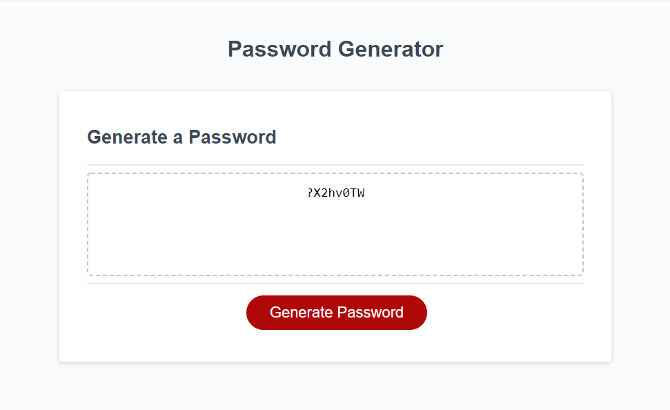

  Password-Generator

       In this project, the client wanted to randomly generate a password that is strong based on criteria selected. 

    -What you will find when you click the generate button.

     * you will be presented with a series of prompts for password criteria.
     *  when you answer each prompt then the password will be written to the page. 
     *The password generated should match all the criteria selected. 

     The following image demonstrates the application functionality:
       
       